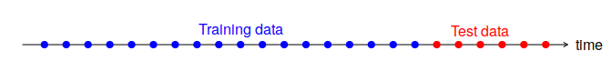

============================
Evaluating forecast models
============================

  + It is common practice to separate the data into two portions, **training** and **test** data.
  + The training data is used to estimate any parameters of a forecasting method and the test data is used
    to evaluate its accuracy
  + Since the test data is not used in determining the forecasts, it should provide a reliable indication of how
    well the model is likely to forecast on new data.

The size of the test set is typically about 20% of the total sample, although this value depends on how long the
sample is and how far ahead you want to forecast.

The test set should ideally be at least as large as the maximum forecast horizon required.

The `ModelSelection.TimeSeriesCV` provides a `scikit-learn` compatible interface for cross-validation
of time series.