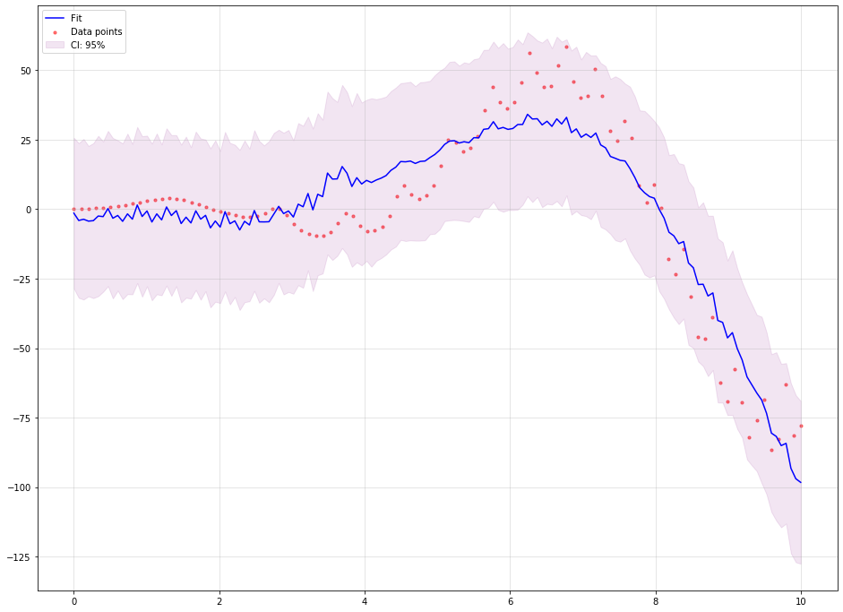

=============================
Nonlinear Regression
=============================

From Linear Regression to Nonlinear Regression
===================================================
Given an arbitrary set of point :math:`\{(X_{i1},\dots, X_{in}, Y_i): i=1,\dots,m\}` and
an arbitrary norm :math:`\|\cdot\|`, a *linear regression*, :math:`\ell_{\|\cdot\|}`,
with respect to the norm corresponds to a tuple of numbers
:math:`(a_1, \dots, a_n, b)` such that

.. math::
    \sum_{i=1}^{m}\|\sum_{j=1}^n a_i X_{ij} + b - Y_i\|

is minimized. Generally the norm is taken to be a wighted Euclidean norm.
Then the association :math:`\ell_{\|\cdot\|}(x_1,\dots,x_n)=\sum_{j=1}^n a_i x_i + b`
provides an approximation for :math:`Y_i`'s with respect to :math:`\|\cdot\|`.

Suppose that a set of basic functions, :math:`B=\{f_0,\dots, f_p\}`, a set of data points
:math:`X = \{(X_i, Y_i) : i=1,\dots, m\}`, and a norm :math:`\|\cdot\|` are given.
A nonlinear regression, :math:`\mathcal{R}_B`, based on :math:`B` and :math:`\|\cdot\|`
corresponds to a tuple :math:`a_0,\dots, a_p` such that

.. math::
    \sum_{i=1}^m \|\sum_{j=0}^p a_j f_j(X_i)-Y_i\|

is minimized.

Define a transformer

.. math::
    \begin{array}{rcl}
        T_B:X & \longrightarrow & \mathbb{R}^{p+1}\\
        x & \mapsto & (f_0(x),\dots, f_p(x)).
    \end{array}

Then it is clear that :math:`\mathcal{R}_B(x) = \ell_{\|\cdot\|}\circ T_{B}(x)`.

Orthonormal system of functions
===============================

Let `X` be a topological space and :math:`\mu` be a finite Borel measure on `X`. The bilinear function :math:`\langle\cdot,\cdot\rangle` defined
on :math:`L_2(X, \mu)` as :math:`\langle f, g\rangle = \int_X fg d\mu` is an inner product which turns :math:`L_2(X, \mu)` into a Hilbert space.

Let us denote the family of all continuous real valued functions on a non-empty compact space `X` by :math:`\textrm{C}(X)`. Suppose that among elements
of :math:`\textrm{C}(X)`, a subfamily `A` of functions are of particular interest.
Suppose that `A` is a subalgebra of :math:`\textrm{C}(X)` containing constants.
We say that an element :math:`f\in\textrm{C}(X)` can be approximated by elements of `A`, if for every :math:`\epsilon>0`, there exists
:math:`p\in A` such that :math:`|f(x)-p(x)|<\epsilon` for every :math:`x\in X`.
The following classical results guarantees when every :math:`f\in\textrm{C}(X)` can be approximated by elements of `A`.

Let :math:`(V, \langle\cdot,\cdot\rangle)` be an inner product space with :math:`\|v\|_2=\langle v,v\rangle^{\frac{1}{2}}`.
A basis :math:`\{v_{\alpha}\}_{\alpha\in I}` is called an orthonormal basis for `V` if :math:`\langle v_{\alpha},v_{\beta}\rangle=\delta_{\alpha\beta}`,
where :math:`\delta_{\alpha\beta}=1` if and only if :math:`\alpha=\beta` and is equal to `0` otherwise.
Every given set of linearly independent vectors can be turned into a set of orthonormal vectors that spans the same sub vector space
as the original. The following well-known result gives an algorithm for producing such orthonormal from a set of linearly independent vectors:

.. note::
    **Gram--Schmidt**

    Let :math:`(V,\langle\cdot,\cdot\rangle)` be an inner product space. Suppose :math:`\{v_{i}\}^{n}_{i=1}` is a set of linearly independent vectors in `V`.
    Let

    .. math::
        u_{1}:=\frac{v_{1}}{\|v_{1}\|_2}

    and (inductively) let

    .. math::
        w_{k}:=v_{k}-\sum_{i=1}^{k-1}\langle v_{k},u_{i}\rangle u_{i}\textrm{ and } u_{k}:=\frac{w_{k}}{\|w_{k}\|_2}.

    Then :math:`\{u_{i}\}_{i=1}^{n}` is an orthonormal collection, and for each `k`,

    .. math::
        span\{u_{1},u_{2},\cdots,u_{k}\}=span\{v_{1},v_{2},\cdots,v_{k}\}.

Note that in the above note, we can even assume that :math:`n=\infty`.

Let :math:`B=\{v_1, v_2, \dots\}` be an ordered basis for :math:`(V,\langle\cdot,\cdot\rangle)`. For any given vector :math:`w\in V` and any initial segment
of `B`, say :math:`B_n=\{v_1,\dots,v_n\}`, there exists a unique :math:`v\in\textrm{span}(B_n)` such that :math:`\|w-v\|_2` is the minimum:

.. note ::
    Let :math:`w\in V` and `B` a finite orthonormal set of vectors (not necessarily a basis). Then for :math:`v=\sum_{u\in B}\langle u,w\rangle u`

    .. math::
        \|w-v\|_2 = \min_{z\in\textrm{span}(B)}\|w-z\|_2.

Now, let :math:`\mu` be a finite measure on `X` and for :math:`f,g\in\textrm{C}(X)` define :math:`\langle f,g\rangle=\int_Xf g d\mu`.
This defines an inner product on the space of functions. The norm induced by the inner product is denoted by :math:`\|\cdot\|_{2}`.
It is evident that

.. math::
    \|f\|_{2}\leq\|f\|_{\infty}\mu(X),~\forall f\in\textrm{C}(X),

which implies that any good approximation in :math:`\|\cdot\|_{\infty}` gives a good :math:`\|\cdot\|_{2}`-approximation. But generally, our interest
is the other way around. Employing Gram-Schmidt procedure, we can find :math:`\|\cdot\|_{2}` within any desired accuracy, but this does not
guarantee a good :math:`\|\cdot\|_{\infty}`-approximation. The situation is favorable in finite dimensional case.
Take :math:`B=\{p_1,\dots,p_n\}\subset\textrm{C}(X)` and :math:`f\in\textrm{C}(X)`, then there exists :math:`K_f>0` such that for every
:math:`g\in\textrm{span}(B\cup\{f\})`,

.. math::
    K_f\|g\|_{\infty}\leq\|g\|_{2\leq}\|g\|_{\infty}\mu(X).

Since `X` is assumed to be compact, :math:`\textrm{C}(X)` is separable, i.e., :math:`\textrm{C}(X)` admits a countable dimensional dense subvector space
(e.g. polynomials for when `X` is a closed, bounded interval). Thus for every :math:`f\in\textrm{C}(X)` and every :math:`\epsilon>0` one can find a
big enough finite `B`, such that the above inequality holds. In other words, good enough :math:`\|\cdot\|_{2}`-approximations of `f` give good
:math:`\|\cdot\|_{\infty}`-approximations, as desired.

**Example.** Polynomial regression on 2-dimensional random data::

    from mpl_toolkits.mplot3d import Axes3D
    from matplotlib import cm
    import matplotlib.pyplot as plt
    import numpy as np
    from GeneralRegression.NpyProximation import HilbertRegressor, Measure
    from GeneralRegression.extras import FunctionBasis
    def randrange(n, vmin, vmax):
        '''
        Helper function to make an array of random numbers having shape (n, )
        with each number distributed Uniform(vmin, vmax).
        '''
        return (vmax - vmin)*np.random.rand(n) + vmin

    # degree of polynomials
    deg = 2
    FB = FunctionBasis()
    B = FB.poly(2, deg)
    # initiate regressor
    regressor = HilbertRegressor(base=B)
    # number of random points
    n = 20
    fig = plt.figure()
    ax = fig.add_subplot(111, projection='3d')
    for c, m, zlow, zhigh in [('k', 'o', -5, -2.5)]:
        xs = randrange(n, 2.3, 3.2)
        ys = randrange(n, 0, 1.0)
        zs = randrange(n, zlow, zhigh)
        ax.scatter(xs, ys, zs, c=c, s=10, marker=m)
    ax.set_xlabel('$X$')
    ax.set_ylabel('$Y$')
    ax.set_zlabel('$f(X,Y)$')
    X = np.array([np.array((xs[_], ys[_])) for _ in range(n)])
    y = np.array([np.array((zs[_],)) for _ in range(n)])
    X_ = np.arange(2.3, 3.2, 0.02)
    Y_ = np.arange(0, 1.0, 0.02)
    _X, _Y = np.meshgrid(X_, Y_)
    # fit the regressor
    regressor.fit(X, y)
    # prepare the plot
    Z = []
    for idx in range(_X.shape[0]):
        _X_ = _X[idx]
        _Y_ = _Y[idx]
        _Z_ = []
        for jdx in range(_X.shape[1]):
            t = np.array([np.array([_X_[jdx], _Y_[jdx]])])
            _Z_.append(regressor.predict(t)[0])
        Z.append(np.array(_Z_))
    Z = np.array(Z)
    surf = ax.plot_surface(_X, _Y, Z, cmap=cm.coolwarm, linewidth=0, antialiased=False, alpha=.3)

.. image:: ./images/polyreg.png
    :height: 400px

Weighted & Unweighted Regression
==================================
The following example demonstrates how to use `GenericRegressor` to perform a nonlinear regression
based on customized function basis. In the example we use a mixture of polynomials, trigonometric
functions and exponential functions of the form :math:`x^k e^{\pm x/\ell}` to estimate the function
:math:`x\times e^{\sin(x^2)} + x^2 \times\cos(x)`.

The confidence interval is the default 95% for points::

    from random import randint

    import matplotlib.pyplot as plt
    import numpy as np
    from sklearn.linear_model import BayesianRidge

    from GeneralRegression.GeneralRegression import GenericRegressor

    plt.figure(randint(1, 1000), figsize=(16, 12))

    # Make up a 1-dim regression data
    n_samples = 100
    f = lambda x: x * np.exp(np.sin(x ** 2)) + np.cos(x) * x ** 2
    X = np.linspace(0., 10, n_samples).reshape((-1, 1))
    y = f(X).reshape((1, -1))[0]

    # Function basis generator
    def mixed(X, p_d=3, f_d=1, l=1., e_d=2):
        """
        A mixture of polynomial, Fourier and exponential functions

        :param X: the domain to be transformed
        :param p_d: the maximum degree of polynomials to be included
        :param f_d: the maximum degree of discrete Fourier transform
        :param e_d: the maximum degree of the `x` coefficient to be included as :math:`x^d\times e^{\pm x}`

        :return: the transformed data points
        """
        points = []
        for x in X:
            point = [1.]
            for deg in range(1, f_d + 1):
                point.append(np.sin(deg * x[0] / l))
                point.append(np.cos(deg * x[0] / l))
            for deg in range(1, p_d + 1):
                point.append(x[0] ** deg)
            for deg in range(e_d + 1):
                point.append((x[0] ** deg) * np.exp(-x[0] / l))
                point.append((x[0] ** deg) * np.exp(x[0] / (2.5 * l)))
            points.append(np.array(point))
        return np.array(points)

    domain = np.linspace(min(X), max(X), 150)

    regressor = GenericRegressor(mixed, regressor=BayesianRidge, **dict(p_d=3, f_d=50, l=1., e_d=0))
    regressor.fit(X, y)
    y_pred = regressor.predict(domain)

    plt.scatter(X, y, color='red', s=10, marker='o', alpha=0.5, label="Data points")
    plt.plot(domain, y_pred, color='blue', label='Fit')
    plt.fill_between(domain.reshape((1, -1))[0],
                     y_pred - regressor.ci_band,
                     y_pred + regressor.ci_band,
                     color='purple',
                     alpha=0.1, label='CI: 95%')
    plt.legend(loc=2)
    plt.grid(True, alpha=.4)
    plt.show()

The output looks like the following image:

Now, we use two different weights to approximate the same function. The first weight puts
more emphasise on the mid points and less on the extreme points, while the second weight
puts less emphasise on the lower values and more on the higher ones. This example shows
how to use `HilbertRegressor` and `GeneralRegression.extras.FunctionBasis`.

In contrast to the previous example, the confidence intervals are 95% defaults for
the curves, not the points::

    import numpy as np
    from sklearn.datasets import make_regression
    import matplotlib.pyplot as plt
    from random import randint

    from GeneralRegression.NpyProximation import HilbertRegressor, Measure
    from GeneralRegression.extras import FunctionBasis

    plt.figure(randint(1, 1000), figsize=(16, 12))
    # Make up a 1-dim regression data
    n_samples = 100
    f = lambda x: x * np.exp(np.sin(x**2)) + np.cos(x)*x ** 2
    X = np.linspace(0., 10, n_samples).reshape((-1,1))
    y = f(X)

    def pfe_1d(p_d=3, f_d=1, l=1.):
        basis = FunctionBasis()
        p_basis = basis.poly(1, p_d)
        f_basis = basis.fourier(1, f_d, l)[1:]
        e_basis = []
        return p_basis + f_basis + e_basis

    domain = np.linspace(min(X), max(X), 150)

    x_min, x_max = X.min(), X.max()
    x_mid = (x_min + x_max) / 2.
    w_min = .1
    w_max = 5.
    ws1 = {_[0]: np.exp(-1./max(abs((_[0]-x_min)*(_[0]-x_max))/10, 1.e-5))
              for _ in X}
    Xs1 = [_[0] for _ in X]
    Ws1 = [ws1[_] for _ in Xs1]

    ws2 = {_[0]: .1 if _[0] < x_mid else 1.
              for _ in X}
    Xs2 = [_[0] for _ in X]
    Ws2 = [ws2[_] for _ in Xs2]

    meas1 = Measure(ws1)
    ell = .7
    B1 = pfe_1d(p_d=3, f_d=20, l=ell)

    regressor1 = HilbertRegressor(base=B1, meas=meas1)
    regressor1.fit(X, y)
    y_pred1 = regressor1.predict(domain)

    meas2 = Measure(ws2)

    regressor2 = HilbertRegressor(base=B1, meas=meas2)
    regressor2.fit(X, y)
    y_pred2 = regressor2.predict(domain)

    fig = plt.figure(randint(1, 10000), constrained_layout=True, figsize=(16, 10))
    gs = fig.add_gridspec(6, 1)
    f_ax1 = fig.add_subplot(gs[:4, :])
    f_ax1.scatter(X, y, color='red', s=10, marker='o', alpha=0.5, label="Data points")
    f_ax1.plot(domain, y_pred1, color='blue', label='Fit 1')
    f_ax1.plot(domain, y_pred2, color='teal', label='Fit 2')
    f_ax1.fill_between(domain.reshape((1, -1))[0],
                     y_pred1 - regressor1.ci_band,
                     y_pred1 + regressor1.ci_band,
                     color='purple',
                     alpha=0.1, label='CI: 95%')
    f_ax1.fill_between(domain.reshape((1, -1))[0],
                     y_pred2 - regressor2.ci_band,
                     y_pred2 + regressor2.ci_band,
                     color='orange',
                     alpha=0.1, label='CI: 95%')
    f_ax1.legend(loc=1)
    f_ax1.grid(True, linestyle='-.', alpha=.4)

    f_ax2 = fig.add_subplot(gs[4, :])
    f_ax2.set_title('Weight 1')
    f_ax2.fill_between(Xs1, [0. for _ in Ws1], Ws1, label='Distibution', color='purple', alpha=.3)
    f_ax2.set_ylabel('Weight')

    f_ax3 = fig.add_subplot(gs[5:, :])
    f_ax3.set_title('Weight 2')
    f_ax3.fill_between(Xs2, [0. for _ in Ws2], Ws2, label='Distibution', color='orange', alpha=.3)
    f_ax3.set_ylabel('Weight')

The output looks like the following image:

.. image:: ./images/weighted.png
    :height: 400px

.. note::
    The major code difference between `GenericRegressor` and `HilbertRegressor` lies in
    the way they accept the basis functions.
    The `funcs` parameter of `GenericRegressor` applies the set of basis function on the
    input points and returns a new set of data points. While `HilbertRegressor` uses a set
    of functions as `base` to perform the required calculations.